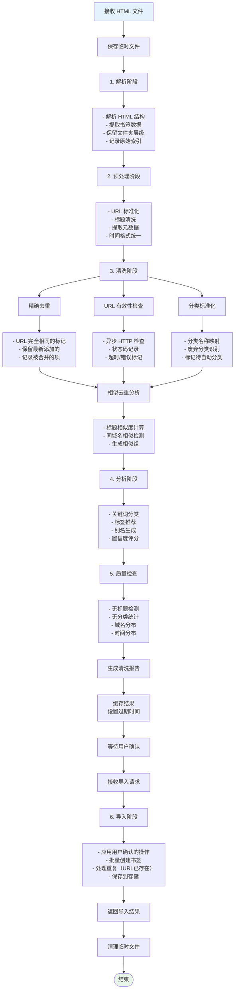
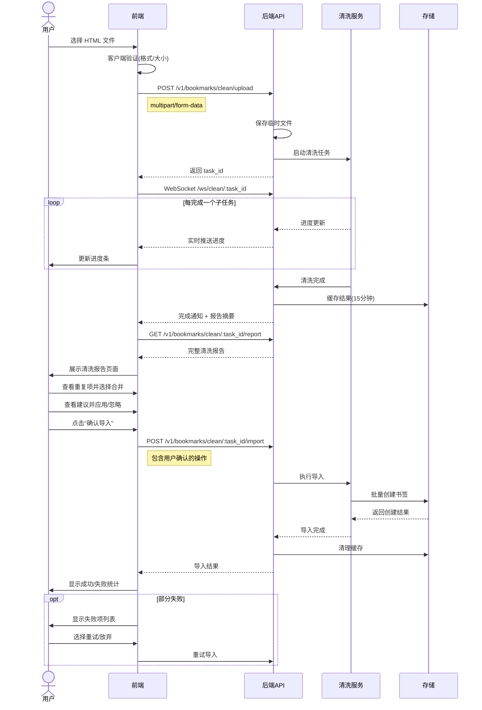

# 书签数据清洗功能 PRD

> 版本: v1.0  
> 日期: 2026-04-01  
> 状态: 评审中

---

## 1. 背景与目标

### 1.1 背景
用户从浏览器导出的书签 HTML 文件通常包含大量"脏数据"：
- 重复收藏（同一页面多次保存）
- 失效链接（网站已下线或页面404）
- 混乱分类（临时文件夹、无意义分类）
- 缺失元数据（无标签、无描述）

### 1.2 目标
提供一站式的数据清洗流程，让用户在上传书签后：
1. **自动处理**常见问题（精确去重、标准化）
2. **半自动处理**需要判断的问题（相似去重）
3. **智能推荐**优化建议（分类、标签、别名）
4. **可视化确认**后再正式导入

### 1.3 清洗程度定义

| 清洗级别 | 自动/手动 | 处理内容 | 预期数据留存率 |
|----------|-----------|----------|----------------|
| **L1 精确清洗** | 自动 | URL完全重复、格式标准化 | 90-95% |
| **L2 质量清洗** | 自动+半自动 | 相似标题合并、失效链接检测 | 80-90% |
| **L3 智能优化** | 自动推荐+手动确认 | 分类修正、标签补充、别名生成 | 100%（优化） |

---

## 2. 用户角色与场景

### 2.1 角色：普通用户
**场景**：导入 Chrome 书签（约 200 条）
```
痛点：
- 很多重复的 GitHub 仓库链接
- 有 "temp"、"新建文件夹" 等无意义分类
- 想自动整理但不敢全信 AI

期望：
- 能看到清洗前后的对比
- 对不确定的合并可以手动选择保留哪个
- 一键应用所有可信的修改
```

### 2.2 角色：高级用户
**场景**：定期同步书签（约 500 条）
```
痛点：
- 每次导入都要处理重复
- 想保留自己的分类习惯

期望：
- 可以配置自动处理规则
- 记住上次的选择偏好
- 增量导入（只处理新增）
```

---

## 3. 功能架构

```
┌─────────────────────────────────────────────────────────────────┐
│                        书签数据清洗流程                          │
├─────────────────────────────────────────────────────────────────┤
│                                                                 │
│   ┌──────────────┐      ┌──────────────┐      ┌──────────────┐ │
│   │   前端界面    │      │   后端服务    │      │   数据处理    │ │
│   └──────┬───────┘      └──────┬───────┘      └──────┬───────┘ │
│          │                     │                     │          │
│          │  1. 上传HTML         │                     │          │
│          │ ──────────────────> │                     │          │
│          │                     │                     │          │
│          │                     │  2. 解析+清洗        │          │
│          │                     │ ──────────────────> │          │
│          │                     │                     │          │
│          │                     │  3. 返回报告         │          │
│          │                     │ <────────────────── │          │
│          │                     │                     │          │
│          │  4. 展示清洗报告     │                     │          │
│          │ <────────────────── │                     │          │
│          │                     │                     │          │
│          │  5. 用户确认         │                     │          │
│          │ ──────────────────> │                     │          │
│          │                     │                     │          │
│          │                     │  6. 导入系统         │          │
│          │                     │ ──────────────────> │          │
│          │                     │                     │          │
│          │  7. 返回结果         │                     │          │
│          │ <────────────────── │                     │          │
│                                                                 │
└─────────────────────────────────────────────────────────────────┘
```

---

## 4. 详细流程设计

### 4.1 前端流程

```mermaid
flowchart TD
    Start([用户点击"导入书签"]) --> Upload[1. 文件上传界面]
    
    Upload --> Validate{文件验证}
    Validate -->|失败| Error1[显示错误: 文件格式不支持]
    Error1 --> Upload
    Validate -->|成功| Options[2. 清洗选项配置]
    
    Options --> Config{
        用户配置选项
        - 自动去重
        - 检查失效链接
        - 智能分类
    }
    
    Config --> Processing[3. 显示处理进度]
    Processing --> WS[建立 WebSocket 连接]
    WS --> Realtime[实时显示进度]
    
    Realtime --> Complete{处理完成?}
    Complete -->|失败| Error2[显示错误信息]
    Error2 --> Retry[重试]
    Retry --> Processing
    
    Complete -->|成功| Report[4. 清洗报告页]
    
    Report --> Summary[统计概览卡片]
    Report --> Duplicates[重复书签区域]
    Report --> Invalid[失效链接区域]
    Report --> Suggestions[优化建议列表]
    
    Duplicates --> DupAction{
        用户操作
        - 合并
        - 保留全部
        - 删除某个
    }
    
    Suggestions --> SugAction{
        用户操作
        - 应用建议
        - 忽略建议
        - 编辑修改
    }
    
    DupAction --> Confirm[5. 确认导入]
    SugAction --> Confirm
    
    Confirm --> Import[调用导入 API]
    Import --> Result{导入结果}
    
    Result -->|成功| Success[显示成功信息<br/>跳转到书签列表]
    Result -->|部分失败| Partial[显示失败项<br/>可重新导入]
    Result -->|失败| Error3[显示错误<br/>保留当前配置]
    
    Success --> End([结束])
    Partial --> End
    Error3 --> Confirm
    
    style Start fill:#e1f5fe
    style End fill:#e8f5e9
    style Error1 fill:#ffebee
    style Error2 fill:#ffebee
    style Error3 fill:#ffebee
```

### 4.2 后端流程



### 4.3 前后端交互时序



---

## 5. 数据清洗详细规范

### 5.1 清洗到什么程度

#### Level 1: 自动精确处理（无需用户确认）

| 清洗项 | 规则 | 示例 |
|--------|------|------|
| **URL 去重** | 标准化后完全相同的 URL | `https://github.com/a` 和 `http://github.com/a` |
| **参数清理** | 移除跟踪参数 | 移除 `utm_source=xxx` |
| **协议统一** | http → https | `http://example.com` → `https://example.com` |
| **标题清洗** | 移除【】[]等前缀 | `【推荐】React教程` → `React教程` |
| **分类映射** | 同义词合并 | `tech` → `技术` |
| **时间标准化** | 统一为 ISO 8601 | 秒级时间戳 → `2026-04-01T10:00:00Z` |

**输出**：清洗后的数据 + 操作日志

#### Level 2: 半自动处理（需要用户确认）

| 清洗项 | 判断标准 | 用户操作选项 |
|--------|----------|--------------|
| **相似标题** | 相似度 > 85% | 合并/保留全部/删除特定 |
| **同域名相似** | 同域名 + 相似度 > 70% | 同上 |
| **失效链接** | 状态码 4xx/5xx 或超时 | 删除/保留/标记 |
| **重定向** | 3xx 且目标不同 | 更新 URL/保留原样 |
| **废弃分类** | 临时/未分类/新建文件夹 | 自动分类/手动指定/保留 |

**输出**：待确认项列表 + 推荐操作

#### Level 3: 智能推荐（用户可选择应用）

| 推荐项 | 生成规则 | 置信度计算 |
|--------|----------|------------|
| **分类建议** | 关键词匹配 + 文件夹路径分析 | 匹配关键词数量 / 总关键词数 |
| **标签建议** | 域名 + 标题关键词 + 分类关联 | 基于历史数据的 TF-IDF |
| **别名建议** | 标题简化 + 域名提取 | 简化后的可读性评分 |
| **分组建议** | 基于分类的层级建议 | 分类的确定性分数 |

**输出**：建议列表 + 置信度分数 + 应用/忽略按钮

### 5.2 数据保留策略

```python
# 清洗配置
CLEANING_POLICY = {
    # L1: 自动处理
    'auto': {
        'exact_dedup': True,           # URL 精确去重
        'normalize_url': True,         # URL 标准化
        'clean_title': True,           # 标题清洗
        'standardize_time': True,      # 时间标准化
        'category_mapping': True,      # 分类映射
    },
    
    # L2: 半自动（需确认）
    'semi_auto': {
        'similar_dedup': {
            'enabled': True,
            'threshold': 0.85,         # 相似度阈值
            'auto_merge_below': 0.95,  # >95% 自动合并
        },
        'url_validation': {
            'enabled': True,
            'timeout': 5,
            'auto_remove_dead': False,  # 不自动删除失效链接
        },
        'deprecated_categories': {
            'auto_classify': ['temp', '临时', '未分类'],
            'keep_as_is': [],
        }
    },
    
    # L3: 推荐
    'suggestions': {
        'category': {
            'enabled': True,
            'min_confidence': 0.6,     # 最低置信度才显示
        },
        'tags': {
            'enabled': True,
            'max_suggestions': 5,      # 最多推荐标签数
        },
        'alias': {
            'enabled': True,
            'only_if_empty': True,     # 只有为空时才推荐
        }
    }
}
```

---

## 6. 接口设计

### 6.1 上传并启动清洗

```http
POST /v1/bookmarks/clean/upload
Content-Type: multipart/form-data

请求体:
{
    "file": "bookmarks.html",           // HTML 文件
    "options": {
        "auto_dedup": true,             // 自动去重
        "check_urls": true,             // 检查 URL 有效性
        "auto_classify": true,          // 自动分类
        "similar_threshold": 0.85       // 相似度阈值
    }
}

响应:
{
    "success": true,
    "data": {
        "task_id": "clean_abc123",
        "status": "processing",
        "websocket_url": "ws://localhost:9001/ws/clean/clean_abc123"
    }
}
```

### 6.2 WebSocket 进度推送

```javascript
// 服务端推送格式
{
    "type": "progress",
    "stage": "parsing",           // parsing | cleaning | analyzing | validating
    "current": 50,                // 当前处理数量
    "total": 150,                 // 总数
    "percentage": 33.3,
    "message": "正在分析书签分类...",
    "details": {
        "exact_duplicates_found": 5,
        "similar_groups_found": 3
    }
}

// 完成推送
{
    "type": "complete",
    "task_id": "clean_abc123",
    "summary": {
        "total": 150,
        "after_cleaning": 138,
        "exact_duplicates": 5,
        "similar_groups": 3,
        "invalid_urls": 2
    }
}
```

### 6.3 获取清洗报告

```http
GET /v1/bookmarks/clean/:task_id/report

响应:
{
    "success": true,
    "data": {
        "summary": {
            "original_count": 150,
            "after_cleaning": 138,
            "exact_duplicates_removed": 5,
            "similar_groups_pending": 3,
            "invalid_urls_found": 2,
            "suggestions_generated": 45
        },
        
        // 精确去重结果（已处理）
        "exact_duplicates": [
            {
                "kept": { /* 保留的项 */ },
                "removed": [{ /* 被合并的项 */ }]
            }
        ],
        
        // 相似组（需用户确认）
        "similar_groups": [
            {
                "group_id": "sim_1",
                "similarity": 0.92,
                "reason": "标题相似",
                "items": [
                    { "id": "1", "title": "React 官方文档", "url": "..." },
                    { "id": "2", "title": "React Documentation", "url": "..." }
                ],
                "suggested_action": "merge"
            }
        ],
        
        // 失效链接
        "invalid_urls": [
            {
                "id": "3",
                "title": "某某教程",
                "url": "https://dead-link.com",
                "status": 404,
                "checked_at": "2026-04-01T10:00:00Z"
            }
        ],
        
        // 优化建议
        "suggestions": [
            {
                "bookmark_id": "4",
                "type": "category_change",
                "field": "category",
                "current": "未分类",
                "suggested": "前端开发",
                "confidence": 0.85,
                "reason": "基于 URL github.com/facebook/react 分析"
            },
            {
                "bookmark_id": "4",
                "type": "tag_add",
                "field": "tags",
                "current": [],
                "suggested": ["React", "前端", "开源"],
                "confidence": 0.78
            }
        ],
        
        // 清洗后的完整数据
        "bookmarks": [
            {
                "id": "bm_1",
                "title": "React 官方文档",
                "url": "https://react.dev",
                "original_category": "前端",
                "suggested_category": "前端开发",
                "suggested_tags": ["React", "文档"],
                "cleaned": true,
                "changes": ["url_normalized", "title_cleaned"]
            }
        ]
    }
}
```

### 6.4 确认导入

```http
POST /v1/bookmarks/clean/:task_id/import

请求体:
{
    // 用户对相似组的决定
    "similar_groups_decisions": [
        {
            "group_id": "sim_1",
            "action": "merge",          // merge | keep_all | delete_specific
            "keep_id": "1",             // merge 时保留的 ID
            "delete_ids": ["2"]         // delete_specific 时删除的 ID
        }
    ],
    
    // 对失效链接的处理
    "invalid_url_decisions": [
        {
            "bookmark_id": "3",
            "action": "delete"          // delete | keep
        }
    ],
    
    // 要应用的优化建议
    "applied_suggestions": [
        {
            "bookmark_id": "4",
            "suggestion_type": "category_change",
            "apply": true
        },
        {
            "bookmark_id": "4",
            "suggestion_type": "tag_add",
            "apply": true,
            "selected_tags": ["React", "前端"]  // 可以选择部分标签
        }
    ],
    
    // 全局导入设置
    "import_settings": {
        "skip_existing": false,         // 跳过已存在的
        "update_existing": true,        // 更新已存在的
        "tag_conflict": "merge"         // 标签冲突时: merge | replace | keep_original
    }
}

响应:
{
    "success": true,
    "data": {
        "imported": 125,
        "updated": 5,
        "skipped": 3,
        "failed": 0,
        "details": {
            "created_ids": ["bm_1", "bm_2", ...],
            "updated_ids": ["bm_3"],
            "failed_items": []
        }
    }
}
```

---

## 7. 前端页面设计

### 7.1 页面流程

```
导入书签
   ├── 步骤1: 上传文件
   │     ├── 文件选择拖拽区
   │     ├── 选项配置面板
   │     └── 开始清洗按钮
   │
   ├── 步骤2: 处理中
   │     ├── 进度条
   │     ├── 实时日志
   │     └── 取消按钮
   │
   └── 步骤3: 清洗报告
         ├── 统计概览卡片
         ├── 重复项处理区
         ├── 失效链接处理区
         ├── 优化建议列表
         └── 导入确认按钮
```

### 7.2 关键 UI 组件

#### 清洗报告页布局

```
┌──────────────────────────────────────────────────────────────────┐
│ 导入书签                                              [关闭]       │
├──────────────────────────────────────────────────────────────────┤
│                                                                  │
│  📊 清洗报告                                      共 138/150 条   │
│  ┌────────────────┬────────────────┬────────────────┐           │
│  │ 🗑️  精确重复   │ 🔗 失效链接    │ 💡 优化建议    │           │
│  │ 已合并 5 组    │ 发现 2 条      │ 45 条待确认    │           │
│  │                │                │                │           │
│  │ [查看详情]     │ [查看详情]     │ [查看详情]     │           │
│  └────────────────┴────────────────┴────────────────┘           │
│                                                                  │
├──────────────────────────────────────────────────────────────────┤
│                                                                  │
│  ⚠️  相似书签组（3 组）                    [全部保留] [智能合并]  │
│  ┌────────────────────────────────────────────────────────────┐ │
│  │ 组 1 - 相似度 92%                                           │ │
│  │ ┌────────────────────────────────────────────────────────┐ │ │
│  │ │ ○ React 官方文档 - react.dev                           │ │ │
│  │ │ ● React Documentation - react.dev [推荐保留]          │ │ │
│  │ └────────────────────────────────────────────────────────┘ │ │
│  │ [保留第一个]  [保留第二个]  [都保留]  [合并为:] [React文档 ▼] │ │
│  └────────────────────────────────────────────────────────────┘ │
│  ┌────────────────────────────────────────────────────────────┐ │
│  │ 组 2 - 相似度 88% ...                                       │ │
│  └────────────────────────────────────────────────────────────┘ │
│                                                                  │
├──────────────────────────────────────────────────────────────────┤
│                                                                  │
│  💡 优化建议（45 条）                         [全部应用] [全部忽略] │
│  ┌────────────────────────────────────────────────────────────┐ │
│  │ [高置信度] React 官方文档                                    │ │
│  │   分类：未分类 → 前端开发 ✓  置信度 95%                      │ │
│  │   标签：+React +前端 +文档                                   │ │
│  │   [应用]  [忽略]  [编辑 ✏️]                                  │ │
│  └────────────────────────────────────────────────────────────┘ │
│  ┌────────────────────────────────────────────────────────────┐ │
│  │ [中置信度] 某某教程                                          │ │
│  │   分类：临时 → 技术博客 ?  置信度 72%                        │ │
│  │   [应用]  [忽略]  [编辑 ✏️]                                  │ │
│  └────────────────────────────────────────────────────────────┘ │
│  [加载更多...]                                                   │
│                                                                  │
├──────────────────────────────────────────────────────────────────┤
│                                                                  │
│  ⚙️  导入设置                                                    │
│  [ ] 跳过已存在的书签    [✓] 更新已有书签的标签               │
│                                                                  │
├──────────────────────────────────────────────────────────────────┤
│                                                                  │
│                    [取消导入]  [确认导入 138 条]                 │
│                                                                  │
└──────────────────────────────────────────────────────────────────┘
```

---

## 8. 非功能需求

### 8.1 性能要求

| 指标 | 目标 | 说明 |
|------|------|------|
| 解析速度 | > 1000 条/秒 | HTML 解析 |
| URL 检查 | 10 并发 | 避免被封 |
| 响应时间 | < 200ms | 除 URL 检查外 |
| 内存占用 | < 500MB | 处理 1000 条 |
| 缓存时间 | 15 分钟 | 清洗结果保留 |

### 8.2 兼容性

- **浏览器格式**: Chrome, Firefox, Safari, Edge 导出的 HTML
- **文件大小**: 最大支持 10MB（约 5000 条书签）
- **编码**: UTF-8（自动检测并转换）

### 8.3 错误处理

| 错误类型 | 处理方式 |
|----------|----------|
| 文件格式错误 | 返回具体错误，提示正确的文件格式 |
| 解析失败 | 跳过失败项，继续处理其他，最后报告 |
| URL 检查超时 | 标记为"未知状态"，不阻止导入 |
| 导入部分失败 | 返回成功/失败明细，支持重试 |

---

## 9. 数据统计

### 9.1 清洗效果指标

```python
# 记录每次清洗的指标
CleaningMetrics = {
    "task_id": "clean_abc123",
    "timestamp": "2026-04-01T10:00:00Z",
    "user_id": "user_123",
    
    "input": {
        "total_bookmarks": 150,
        "file_size_bytes": 256000,
        "source": "chrome_export"
    },
    
    "output": {
        "after_cleaning": 138,
        "exact_duplicates_removed": 5,
        "similar_groups_merged": 3,
        "invalid_urls_removed": 2,
        "suggestions_applied": 42
    },
    
    "performance": {
        "parse_time_ms": 150,
        "clean_time_ms": 2300,
        "analyze_time_ms": 1800,
        "validate_time_ms": 5000,
        "total_time_ms": 9250
    }
}
```

---

## 10. 附录

### 10.1 分类映射表

```python
CATEGORY_MAPPING = {
    # 中英文映射
    'tech': '技术',
    'technology': '技术',
    'programming': '编程',
    'dev': '开发',
    
    # 细分领域
    'frontend': '前端',
    'front-end': '前端',
    'backend': '后端',
    'back-end': '后端',
    'fullstack': '全栈',
    
    # 待废弃
    'temp': None,
    'temporary': None,
    'misc': None,
    '未分类': None,
    '新建文件夹': None,
}
```

### 10.2 URL 标准化规则

```python
URL_NORMALIZATION_RULES = [
    # 协议统一
    (r'^http://', 'https://'),
    
    # 移除 www
    (r'^https://www\.', 'https://'),
    
    # 小写域名
    (lambda url: url.lower() if '://' in url else url),
    
    # 移除跟踪参数
    (r'[?&](utm_source|utm_medium|utm_campaign|fbclid|gclid)=[^&]+', ''),
    
    # 移除尾部斜杠
    (r'/+$', ''),
]
```

---

*文档维护：更新后同步修改版本号*
