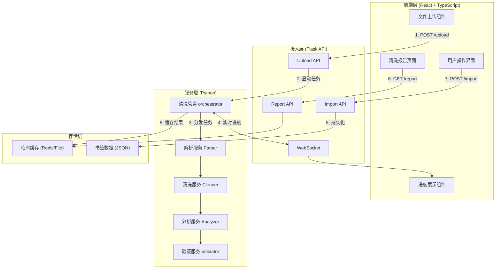
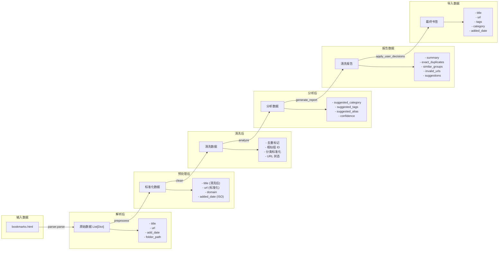
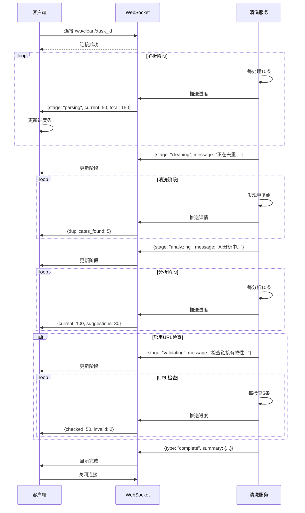
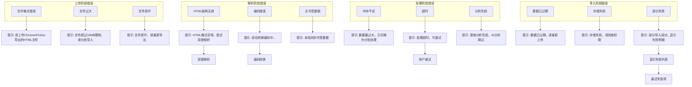
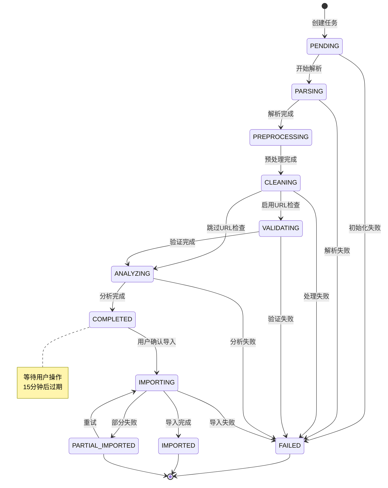
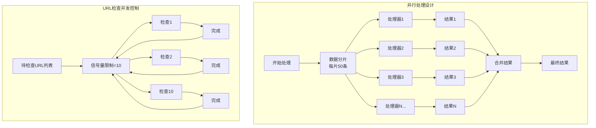

# 数据清洗流程图

> 本文档使用 Mermaid 语法描述完整的数据清洗流程
> 可在支持 Mermaid 的编辑器（如 VS Code、Notion、GitHub）中渲染

---

## 1. 整体架构图



---

## 2. 前端详细流程

```mermaid
flowchart TD
    Start([用户点击"导入书签"]) --> CheckAuth{检查登录}
    CheckAuth -->|未登录| Login["跳转登录"]
    Login --> Start
    CheckAuth -->|已登录| UploadPage["步骤1: 上传页面"]
    
    UploadPage --> FileSelect["文件选择"]
    FileSelect --> FileValidate["文件验证"]
    
    FileValidate -->|格式错误| Error1["显示错误: 请上传HTML文件"]
    FileValidate -->|过大| Error2["显示错误: 文件超过10MB"]
    FileValidate -->|成功| Options["清洗选项配置"]
    
    Error1 --> FileSelect
    Error2 --> FileSelect
    
    Options --> Option1["☑️ 自动去重"]
    Options --> Option2["☑️ 检查失效链接"]
    Options --> Option3["☑️ 智能分类"]
    Options --> Option4["相似度阈值: 85%"]
    
    Option1 --> StartClean["开始清洗"]
    Option2 --> StartClean
    Option3 --> StartClean
    Option4 --> StartClean
    
    StartClean --> UploadAPI["POST /upload"]
    UploadAPI -->|"返回 task_id"| ProgressPage["步骤2: 处理进度页"]
    
    ProgressPage --> WSConnect["建立 WebSocket"]
    WSConnect --> ProgressBar["进度条展示"]
    ProgressBar --> Stage1["📄 解析中..."]
    Stage1 --> Stage2["🧹 清洗中..."]
    Stage2 --> Stage3["🔍 分析中..."]
    Stage3 --> Stage4["✅ 完成"
    ]
    
    Stage4 --> ReportPage["步骤3: 清洗报告页"]
    
    ReportPage --> Summary["统计概览"]
    Summary --> Card1["原始: 150条"]
    Summary --> Card2["清洗后: 138条"]
    Summary --> Card3["重复: 5组"]
    Summary --> Card4["建议: 45条"]
    
    ReportPage --> Tabs["Tab切换"]
    Tabs --> Tab1["⚠️ 重复项(3)"]
    Tabs --> Tab2["🔗 失效链接(2)"]
    Tabs --> Tab3["💡 优化建议(45)"]
    
    Tab1 --> DupGroup1["相似组1"]
    DupGroup1 --> DupAction1{"用户操作"}
    DupAction1 -->|合并| Merge1["保留选中项"]
    DupAction1 -->|保留全部| KeepAll1["不做处理"]
    DupAction1 -->|删除| Delete1["删除选中项"]
    
    Tab2 --> InvalidList["失效链接列表"]
    InvalidList --> InvalidAction{"批量操作"}
    InvalidAction -->|删除全部| DeleteAll
    InvalidAction -->|保留| KeepInvalid
    InvalidAction -->|逐个决定| DecideOne
    
    Tab3 --> SuggestionList["建议列表"]
    SuggestionList --> SuggestionItem["单项建议"]
    SuggestionItem --> SugAction{"操作"}
    SugAction -->|应用| ApplySug
    SugAction -->|忽略| IgnoreSug
    SugAction -->|编辑| EditSug["弹窗编辑"]
    
    Merge1 --> ConfirmImport
    KeepAll1 --> ConfirmImport
    Delete1 --> ConfirmImport
    DeleteAll --> ConfirmImport
    KeepInvalid --> ConfirmImport
    DecideOne --> ConfirmImport
    ApplySug --> ConfirmImport
    IgnoreSug --> ConfirmImport
    EditSug --> ConfirmImport
    
    ConfirmImport["确认导入"] --> ImportAPI["POST /import"]
    ImportAPI --> ResultPage["步骤4: 结果页"]
    
    ResultPage --> Success["导入成功 138条"]
    ResultPage --> Partial["部分成功 135/138"]
    ResultPage --> Fail["导入失败"]
    
    Partial --> Retry["重试失败项"]
    Retry --> ImportAPI
    
    Fail --> BackToReport["返回报告页"]
    BackToReport --> ConfirmImport
    
    Success --> ViewBookmarks["查看书签列表"]
    
    style Start fill:#e3f2fd
    style Success fill:#e8f5e9
    style Fail fill:#ffebee
```

---

## 3. 后端详细流程

```mermaid
flowchart TD
    Receive["接收上传请求"] --> SaveTemp["保存临时文件"]
    
    subgraph ParseStage ["阶段1: 解析"]
        SaveTemp --> ParseHTML["BeautifulSoup 解析 HTML"]
        ParseHTML --> ExtractDL["提取 DL/DT/A 标签"]
        ExtractDL --> BuildTree["构建文件夹树"]
        BuildTree --> ExtractMeta["提取元数据"]
        ExtractMeta --> RawData["原始书签数据"]
    end
    
    subgraph PreprocessStage ["阶段2: 预处理"]
        RawData --> NormalizeURL["URL 标准化"]
        NormalizeURL --> RemoveTrack["移除跟踪参数"]
        RemoveTrack --> CleanTitle["标题清洗"]
        CleanTitle --> ExtractDomain["提取域名"]
        ExtractDomain --> ParseTime["解析时间戳"]
    end
    
    subgraph CleanStage ["阶段3: 清洗"]
        ParseTime --> Deduplicate["精确去重"]
        Deduplicate --> CheckExact{"URL 相同?"}
        CheckExact -->|是| MarkDup["标记重复组"]
        CheckExact -->|否| KeepUnique
        MarkDup --> KeepLatest["保留最新添加"]
        
        KeepUnique --> StandardizeCat["分类标准化"]
        StandardizeCat --> CheckCat{"分类有效?"}
        CheckCat -->|否| MarkReclassify["标记待重分类"]
        CheckCat -->|是| PassCat
        MarkReclassify --> PassCat
        
        PassCat --> SimilarCheck["相似度检查"]
        SimilarCheck --> CalcSim["计算标题相似度"]
        CalcSim --> GroupSim["分组相似项"]
        GroupSim --> MarkSimilar["标记相似组"]
    end
    
    subgraph ValidateStage ["阶段4: 验证"]
        MarkSimilar --> CheckURL["URL 有效性检查"]
        CheckURL --> AsyncCheck["异步 HTTP 检查"]
        AsyncCheck --> CheckStatus{"状态码"}
        CheckStatus -->|2xx| MarkValid["标记有效"]
        CheckStatus -->|3xx| MarkRedirect["标记重定向"]
        CheckStatus -->|4xx/5xx| MarkInvalid["标记失效"]
        CheckStatus -->|超时| MarkTimeout["标记超时"]
    end
    
    subgraph AnalyzeStage ["阶段5: 分析"]
        MarkValid --> KeywordMatch["关键词匹配"]
        MarkRedirect --> KeywordMatch
        MarkTimeout --> KeywordMatch
        
        KeywordMatch --> SuggestCat["推荐分类"]
        SuggestCat --> SuggestTags["推荐标签"]
        SuggestTags --> GenAlias["生成别名"]
        GenAlias --> CalcConfidence["计算置信度"]
    end
    
    subgraph ReportStage ["阶段6: 生成报告"]
        CalcConfidence --> CompileStats["编译统计信息"]
        CompileStats --> BuildSummary["构建概览"]
        BuildSummary --> CacheResult["缓存结果"]
    end
    
    CacheResult --> WaitConfirm["等待用户确认"]
    
    subgraph ImportStage ["阶段7: 导入"]
        WaitConfirm --> ReceiveConfirm["接收导入请求"]
        ReceiveConfirm --> ApplyDecision["应用用户决策"]
        ApplyDecision --> MergeDup["合并重复项"]
        ApplyDecision --> DeleteInvalid["删除失效项"]
        ApplyDecision --> ApplySug["应用优化建议"]
        
        MergeDup --> CheckExist["检查已存在"]
        DeleteInvalid --> CheckExist
        ApplySug --> CheckExist
        
        CheckExist --> ExistAction{"已存在?"}
        ExistAction -->|是+更新| UpdateExist["更新书签"]
        ExistAction -->|是+跳过| SkipBookmark["跳过"]
        ExistAction -->|否| CreateNew["创建新书签"]
        
        UpdateExist --> SaveStorage
        SkipBookmark --> SaveStorage
        CreateNew --> SaveStorage["保存到存储"]
        
        SaveStorage --> CleanTemp["清理临时文件"]
    end
    
    CleanTemp --> ReturnResult["返回导入结果"]
    ReturnResult --> End([结束])
    
    style ParseStage fill:#e3f2fd
    style CleanStage fill:#fff3e0
    style AnalyzeStage fill:#f3e5f5
    style ImportStage fill:#e8f5e9
```



---

## 4. 数据流转图



---

## 5. WebSocket 实时进度流程



---

## 6. 错误处理流程



---

## 7. 状态机图

### 任务状态流转



---

## 8. 并发处理流程



---

*流程图使用 Mermaid 语法，可在支持 Mermaid 的编辑器中渲染查看*
